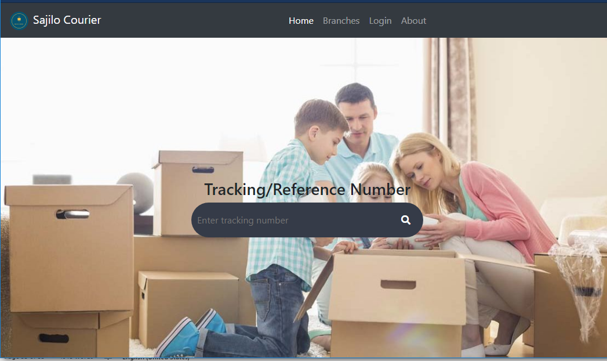
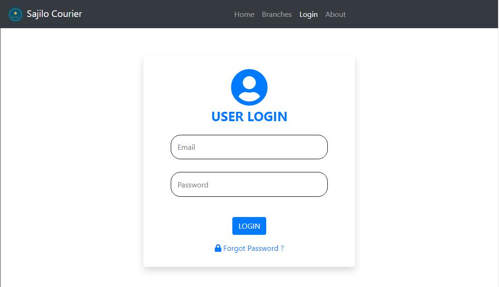
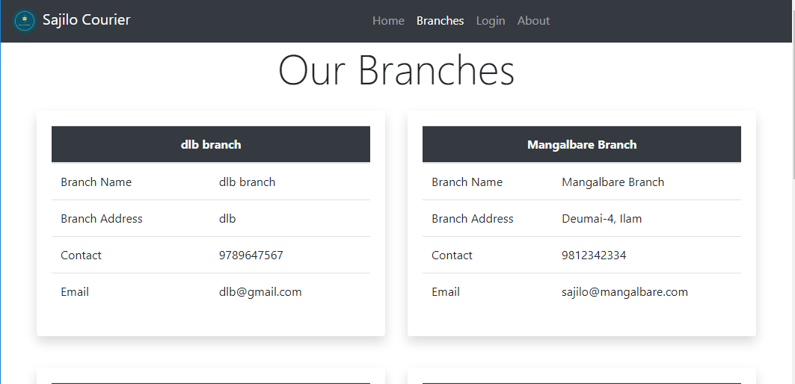
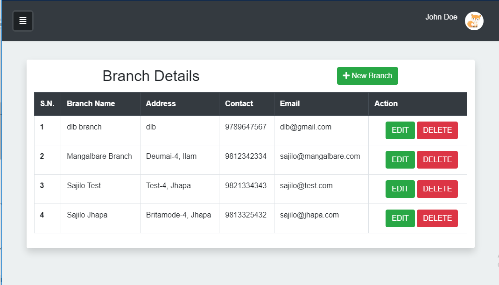
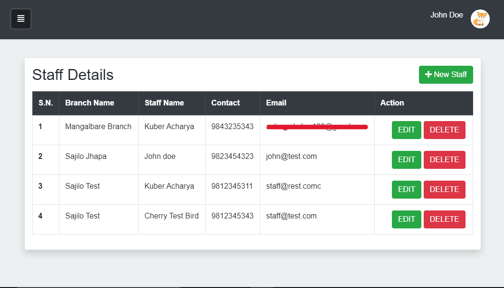
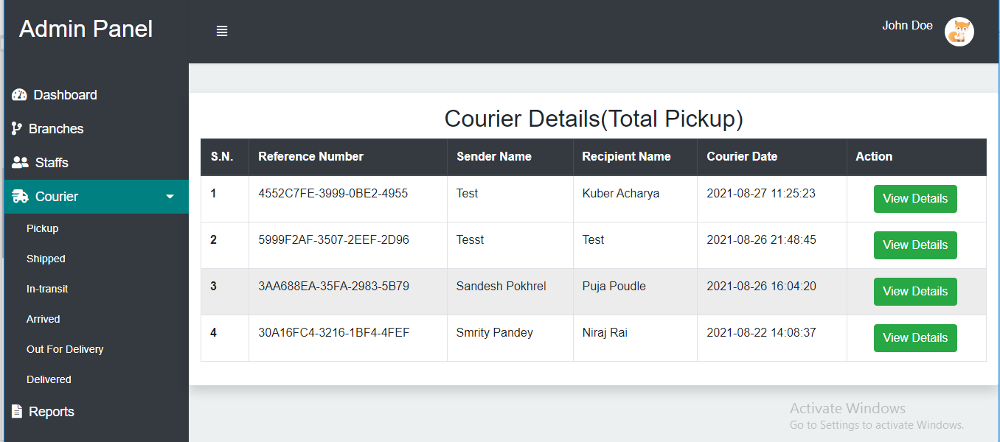
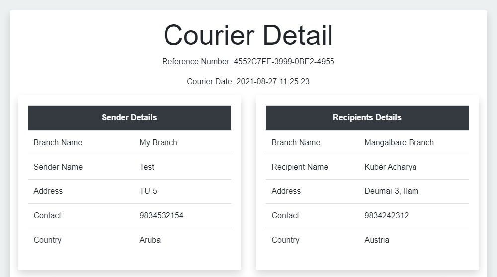
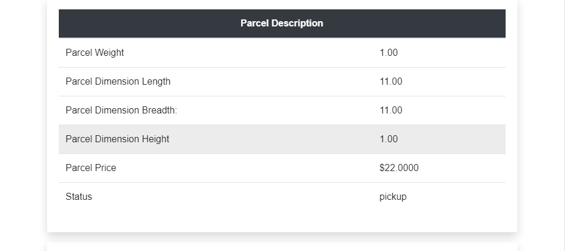

# Sajilo Courier

Sajilo Courier is a simple courier management system built during my 4th semester as a requirement for the BCA program at TU.

> **Caution:** As this is my first project as a beginner, there might be some parts that do not look professional and optimized.

The project is built by implementing a custom MVC architectural pattern using PHP and MySQL. However, it does not include things like routing, ORM, etc. It is purely implemented using core PHP following a simple MVC architectural pattern.

## Functional Requirements

The system includes the following functionalities:

1. Allows admin and staff to login to their user accounts.
2. Allows admin to add, update branch and staff details.
3. Allows admin to check courier details filled by different staff.
4. Allows admin to generate courier count report.
5. Allows staff to add, update courier details.
6. Allows staff to search for particular courier’s details.
7. Allows customers to check their parcel’s status using reference/tracking number.
8. Allows customers to view different branch’s details.

During this project, I gained lots of experience to move forward and this is showcased as my learning path. As an academic project, I created proper reports and figures such as Data Flow Diagram, Entity Relationship Diagram, Sequence Diagram, Use Case Diagram. Some of them are included in the folder called "figures" which you can access for reference.

## Screenshots

## Project Setup

1. Clone the repo.
2. Set up the database and import the blank schema from `schema/blank_schema.sql`.
3. Configure database credentials from `service/Config.php`.

## Contributing

This project is open for improvements and I would appreciate your input. Feel free to fork and send a pull request.
